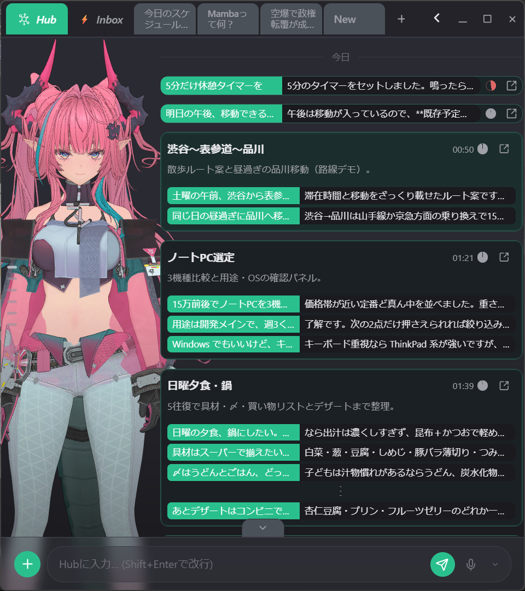
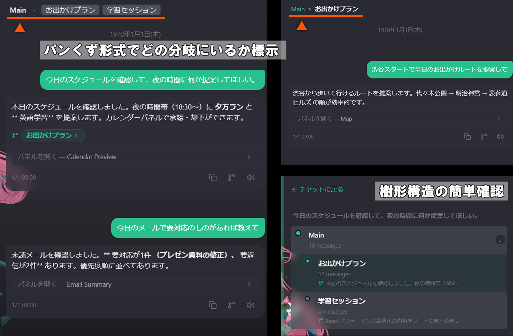
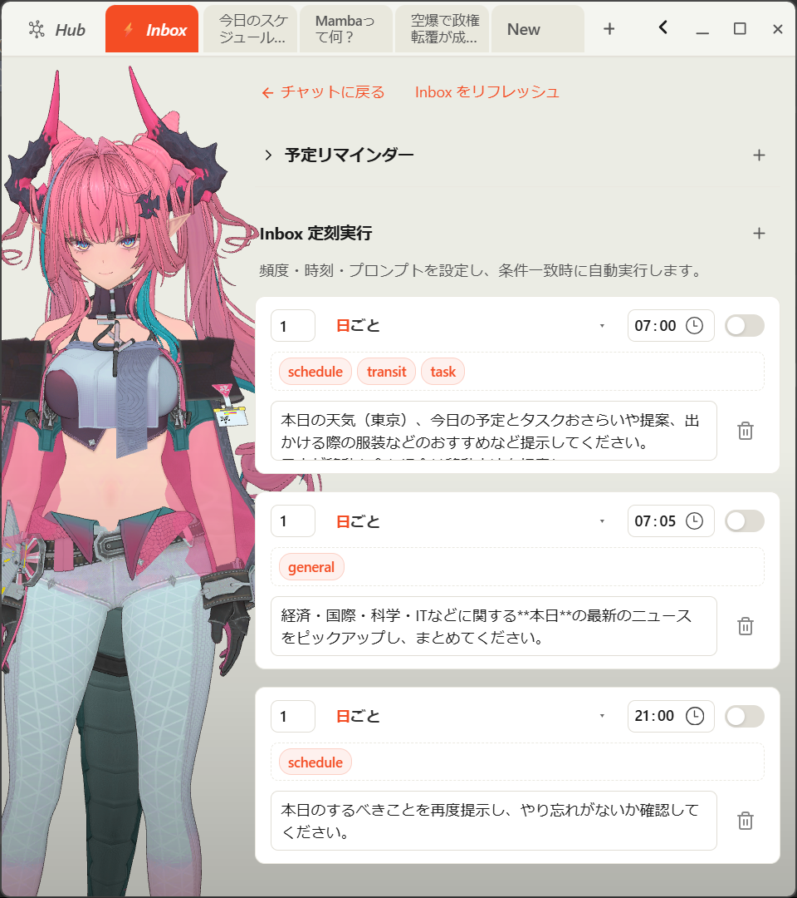
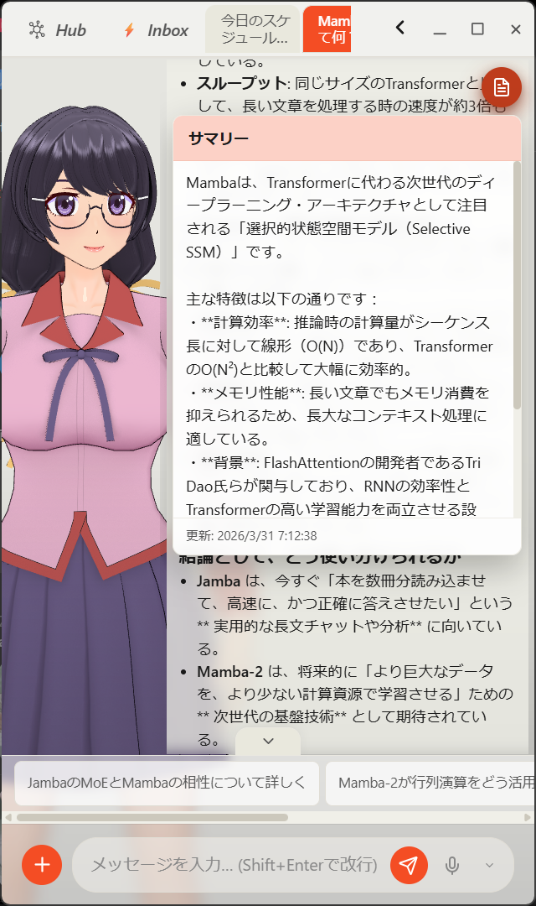
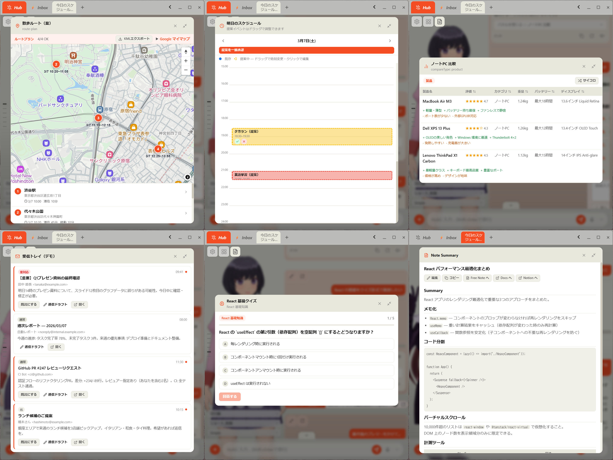
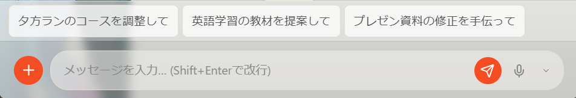
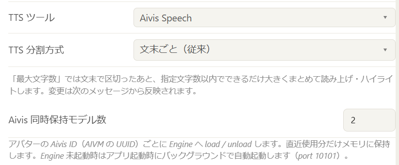
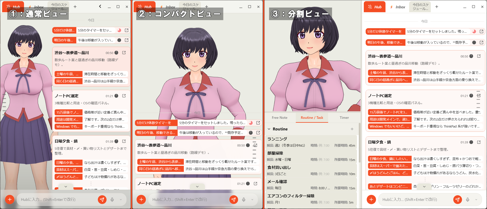

# Moirai
**Your Beside / パーソナルAIコンシェルジュ**

## 開発の経緯

ChatGPTやClaudeのブラウザ版・アプリ版を日常的に使う中で、いくつかの不満を感じたことが開発のきっかけです。1スレッドの会話はすぐ流れて過去の文脈が埋もれてしまう、わき道の話をすると本筋が失われる、毎回同じような確認や定型作業を繰り返す、声で話しかけても気の利いた返事や継続的な記憶が返ってこない——こうした「単発の応答ツール」としての限界が積み重なっていきました。  
自分が欲しかったのは、単に質問に答えるチャットボットではなく、日々の会話・予定・記憶を引き継ぎながら隣で動き続ける、IA（Intelligence Amplifier）としてのAIでした。Hubによる話題横断の記憶整理、樹形分岐による脱線のしやすさ、Inboxによる能動的な通知、音声とVRMアバターによる身体性——既存のチャットUIが切り落としていた要素を、一つのデスクトップアプリとして再構成する形でMoiraiの開発に着手しました。

<p align="center">
<strong><span style="font-size: x-large">Hub・樹形分岐・Inboxで、埋もれる文脈と単発応答の限界を超える</span></strong><br>
<strong><span style="font-size: x-large">会話・予定・記憶を引き継ぎながら隣で動き続ける IA（Intelligence Amplifier）</span></strong><br>
<strong><span style="font-size: x-large">音声と VRM アバターで、チャット UI が切り落とした身体性まで再構成</span></strong>
</p>

Moiraiは、日常の会話・予定管理・情報整理・音声対応を一体化したデスクトップ向けAIコンシェルジュです。  
本プロジェクトは**Windows向け**かつ**日本語環境専用**として設計されています。

> **部分公開中** — この GitHub リポジトリでは **コアロジックのみ** を公開しています（`src/lib/` の Hub・LLM パイプライン・STM/LTM・Inbox・応答パース等、および関連ドキュメント）。**UI・スタイル・ビルド設定・Tauri バックエンド・音声/VRM 実装は非公開**です。インストーラーや配布ビルドもありません。README・デモ動画・スクリーンショットで全体像を、公開ソースで会話エンジンの設計をご確認ください。

## チャット UX のハイライト

一般チャットとの差が出やすい点だけ、先にまとめます（詳細は [他のチャットアプリとの違い](#他のチャットアプリとの違い)）。

| 機能 | 何が違うか |
|------|------------|
| **Hub（統一エントリー）** | セッション横断の**短期共通入口**。話題転換でチャンクを自動分割し、タイトル・要約・重要度・TTL で圧縮整理。圧縮チャンクは**ワンクリックで再開**、必要なら**個別チャットへ分離**。チャンクレールで該当位置へジャンプ。 |
| **Inbox** | 専用タブで **AI の能動通知**・**定刻プロンプト**（日/週/月ルール）・**リマインド**を受信。スケジュールに沿った自動実行と TTS 通知にも対応。 |
| **提案ボタン** | AI が返す「次に送れる文」を、入力欄直上の**ボタン列**として表示。クリックで入力欄にセット。 |
| **樹形分岐の見える化** | メッセージから fork した枝が**パンくず・兄弟ブランチボタン・タブの深さ表示（`·`）**で一目把握できる。主軸を切らずにわき道へそれやすい。 |
| **メディア参照（`<media>`）** | LLM が `<media>` で返す **画像・動画** を回答直下にインライン表示（`image:` / `video:` / `*_query:`）。サイト参照はリンクボタン。 |
| **読み上げ箇所のハイライト** | TTS ストリーミング中、**今読んでいる文だけ**をメッセージ内でアクセント色ハイライト（文単位で追従）。 |
| **定型プロンプトの呼び出し** | よく使うプロンプトを `/command` で登録。入力中にサジェスト、**Prompt Manager** で編集・タグ管理。 |
| **セッションの自動フォルダ分け** | タブを閉じる／離脱時に LLM がタイトル生成と同時に**フォルダを自動割当**。Log ビューでフォルダフィルタ。Hub チャンクにも適用。 |
| **STM サマリー** | 通常チャットで短期メモリ（STM）があると、右上に**サマリーボタン**が表示。クリックで現在セッションの要約をパネルで確認（外側クリックで閉じる）。 |

## Demo

<a href="https://www.youtube.com/watch?v=C6a61m4LOFs">
  
</a>

*クリックするとYouTubeの外部リンクで開きます。*

## 他のチャットアプリとの違い

一般的な「1スレッド＋吹き出し」型チャットと比べ、Moirai は **Hub・分岐・Inbox・パネル・音声・アバター** を重ねた、デスクトップ伴走型コンシェルジュです。

```text
[Hub / チャンク]  … 話題の連続性と記憶
      ↓
[Session / Branch] … 深掘りとわき道
      ↓
[Inbox]            … 能動・定刻・リマインド
      ↓
[Panel / Tool / TTS / Avatar] … 構造化操作と身体性
```

### 会話モデル・履歴

- **Hub とチャンク** — Scratch を横断的な会話の主軸とし、話題転換でセグメント（チャンク）を自動分割。タイトル・要約・重要度・TTL 付きで整理表示し、チャンクレールからワンクリックで移動できる。

  

- **樹形分岐** — 任意メッセージからブランチを fork。親ブランチの文脈は fork 地点まで引き継ぎ、わき道を切って探索できる。**構造の見える化:** チャット上部の**分岐パンくず**（祖先タブ › 現在タブ › 兄弟ブランチ）、グローバルタブの**深さインジケータ**（`·` の数）、各 AI メッセージ横の**既存分岐へのジャンプ**と fork ボタン。検索結果にもブランチ名を表示。Inbox 側も同様。

  

- **Inbox** — 通常チャットとは別タブで、AI からの能動通知・定刻プロンプト・リマインドを受信。スケジュールルール（日/週/月）と TaskKind 指定の自動実行。

  

- **ターン単位ナビ** — user→assistant をターン番号で管理。サブバー・番号直接入力・↑↓ キー・ダブルクリック先頭/末尾ジャンプ。Hub 圧縮チャンクをまたぐ移動に対応。

  

- **STM サマリー表示（通常チャット）** — 会話が進むと、短期メモリ（STM）の要約が更新される。サマリーがあるとチャット欄右上にボタンが表示され、クリックで現在セッションのサマリーをパネル表示。パネル外クリックで閉じる。

  

- **セッション横断 LTM** — 短期記憶（STM）に加え、長期記憶（LTM）をセッションを超えて保持。カテゴリ別 TTL と confirmedCount による active 昇格。
- **セッションの自動フォルダ分け** — セッションを閉じる／タブ離脱時に LLM がタイトルと同時に**フォルダを自動割当**（手動変更も可）。Log ビューでフォルダ別に一覧・フィルタ。Hub チャンク閉鎖時も同ロジックでフォルダ付与。

### 構造化 UI・リッチ応答

- **Special Panel** — `calendar` / `map` / `transit` / `email` / `news` / `compare` / `note` / `quiz` / `question` など、ドメイン別の操作 UI をメッセージ右に展開（ドラッグ編集・承認フロー付き）。

  

- **提案ボタン（`<prompts>`）** — LLM 応答末尾の `<prompts>` タグをパースし、入力欄直上に**クリック可能な提案ボタン**として表示。次のユーザ発話の候補をワンタップで入力欄へ。

  
- **Mermaid** — Markdown 内の `mermaid` コードブロックをクライアントでレンダリング。
- **確認 UI の二モード** — 本文中の質問と `<question>` 確認パネルを設定で切替。
- **リンクプレビュー** — OGP カード表示。
- **メディア参照（`<media>`）** — LLM 応答末尾の `<media>` タグをパースし、**画像・動画を回答直下にインライン表示**。`image:` / `image_query:` はサムネイル、`video:` / `video_query:` は YouTube 埋め込みまたは HTML5 動画。`site:` / `site_query:` は外部リンクボタン。
- **Web 検索 Citation** — ルーター判定またはユーザーの Web トグルで検索 ON のとき、プロバイダの Web 検索結果を **Citation `[n]`** として本文に埋め込み。番号クリックで参照元プレビュー。

### LLM 経由のアプリ操作

会話の延長上で、タグ/XML によりデスクトップ内機能を直接駆動します。

| 領域 | 内容 |
|------|------|
| YouTube | 検索→アプリ内埋め込み再生、PiP、pause / resume / 音量 |
| メモ | `<note_patch>` による行単位差分編集 |
| タスク | 承認・完了・NotePanel 連携 |
| タイマー・アラーム | NotePanel のタイマータブを LLM から制御 |
| リマインド | Inbox + TTS で定刻通知 |
| メール下書き | インライン `<email-draft>` → Gmail 起動 |
| 原稿推敲 | `<draft>` ブロックの対話的リライト |

### 音声・マルチモーダル

- **ローカル ASR** — `sherpa-onnx` + ReazonSpeech K2 v2 + Silero VAD。ウェイクワード起動時は常にローカル認識。自動送信（無音検出）対応。
- **読み上げ箇所のハイライト** — ストリーミング TTS と同期し、**現在読み上げ中の文**をメッセージ内で `<mark>` ハイライト（`sentence` / `chars` 分割モード、Irodori / Aivis 等、先読みキャッシュ）。リプレイボタンで全文再読上げも可。

  

- **VRM アバター一体型** — 感情タグ・リップシンク・モーション。`split` / `compact` / `fullscreen` の 3 レイアウト。

  
- **ウェイクワード** — `rustpotter` v2（few-shot 登録）。

### コンテキスト拡張・外部連携

- **リンクプリフェッチ** — 送信前に URL を取得して LLM へ注入（GitHub / arXiv / Wikipedia / Hugging Face 等、ドメイン別戦略）。手動「From URL」添付も可。
- **生活コンテキストの先読み** — 発話からの日付抽出→ Calendar 予定プリフェッチ。目標・ルーティン・タスクの TaskKind 連動注入。
- **Google 連携** — OAuth で Calendar / Gmail / Docs を推論中に参照。
- **Web 検索** — ルーター判定またはユーザートグルで有効化。回答本文に **Citation `[n]`** を埋め込み、クリックで参照元プレビュー（上記「Web 検索 Citation」参照）。

### 効率設計

- **ルールベースルーター優先** — キーワードで TaskKind と `fast` / `standard` / `reasoning` を即決。LLM ルーターはフォールバック。プリフェッチとコンテキスト注入で **1ターン完結** を志向。
- **定型プロンプト（`/` ショートカット）** — Prompt Manager に登録した高頻度プロンプトを `/command` で呼び出し。入力中にオートコンプリート、選択で本文を入力欄へ展開。

## Features（技術）

- 複数 LLM ルーティング（`GPT` / `Gemini` / `Claude`）と用途別モード（fast / standard / reasoning）
- 正規表現・キーワードベースのルーター + LLM ルーター（フォールバック）
- URL プリフェッチ（GitHub / arXiv / Wikipedia / Hugging Face 等）
- ウェイクワード検出（`rustpotter` v2, few-shot enrollment）
- ローカル ASR（`sherpa-onnx` + ReazonSpeech K2 v2 + Silero VAD）
- TTS（Aivis Speech / IrodoriTTS sidecar / Aivis Cloud）※ Fish Audio は **WIP**
- STM/LTM メモリ層（STM 圧縮、LTM の TTL 失効・`confirmedCount` による active 昇格）
- VRM アバターレンダリング（Three.js + `@pixiv/three-vrm`）とリップシンク連携
- Tauri コマンド経由のネイティブ機能連携（OGP 取得、音声、ウィンドウ制御など）
- piper-plus 連携は **WIP**

## Architecture

以下の3層で構成されています。

```text
┌──────────────────────────────────────────────────────────┐
│ Frontend: Tauri UI (TypeScript / React)                 │
│ - Chat UI, Router, Memory(STM/LTM), VRM, URL Prefetch   │
└──────────────────────────────┬───────────────────────────┘
                               │ invoke
┌──────────────────────────────▼───────────────────────────┐
│ Backend: Rust (Tauri commands)                           │
│ - Wake Word(rustpotter), Local ASR(sherpa-onnx), OGP     │
└──────────────────────────────┬───────────────────────────┘
                               │ sidecar process
┌──────────────────────────────▼───────────────────────────┐
│ Python Sidecar: FastAPI                                  │
│ - IrodoriTTS synthesis server                            │
└──────────────────────────────────────────────────────────┘
```

## Tech Stack

- Rust / Tauri v2
- TypeScript / React
- Python / FastAPI (sidecar)
- LLM APIs: OpenAI, Google Gemini, Anthropic Claude
- TTS: Aivis Speech, IrodoriTTS, Aivis Cloud（Fish Audio: WIP）
- ASR: sherpa-onnx + ReazonSpeech K2 v2
- 3D Avatar: Three.js + VRM (`@pixiv/three-vrm`)
- Wake Word: rustpotter

## Requirements

- **OS:** Windows 10/11（本アプリは Windows 専用）
- **Language Environment:** 日本語環境（本アプリは日本語環境専用）
- Node.js: 20+（推奨: 20 LTS 以上）
- Rust: 1.82.0+（`src-tauri/Cargo.toml` 準拠）
- Python: 3.x（sidecar 利用時）
- CUDA 対応 GPU: 一部 TTS 構成（例: IrodoriTTS）で実質必須

## 公開状況

| 項目 | 状態 |
|------|------|
| README・デモ動画・スクリーンショット | 公開中（本リポジトリ） |
| コアロジック（`src/lib/` — Hub / LLM / Memory / Inbox / Response 等） | **部分公開中** |
| 関連ドキュメント（`docs/llm-architecture.md` 等） | **部分公開中** |
| UI・スタイル・ビルド設定 | **未公開** |
| Tauri バックエンド・音声 / VRM 実装 | **未公開** |
| インストーラー / 配布ビルド | 未提供 |

公開中のコアロジックは参照・学習用です。単体ではビルド・実行できません。フルソース公開後にローカルビルド手順（`npm install` → `npm run tauri dev` 等）を README に追記する予定です。

---

# Moirai
**Your Beside / Personal AI Concierge**

## Origin

Using ChatGPT and Claude daily—in browser and app—I kept hitting the same walls: one thread buries past context, tangents derail the main line, the same confirmations and routine work repeat, and voice input still feels like a one-shot reply with no lasting memory.  
What I wanted was not a Q&A chatbot but an **IA (Intelligence Amplifier)** that stays beside you—carrying conversation, schedule, and memory forward. Moirai reassembles what typical chat UIs drop: **Hub** for cross-topic memory, **tree branching** for easy tangents, **Inbox** for proactive nudges, and **voice + VRM avatar** for embodiment—in one desktop app.

<p align="center">
<strong><span style="font-size: x-large">Hub, branching, and Inbox—beyond buried context and one-shot replies</span></strong><br>
<strong><span style="font-size: x-large">An IA that keeps conversation, schedule, and memory alive beside you</span></strong><br>
<strong><span style="font-size: x-large">Voice and VRM avatar restore what chat UIs left behind</span></strong>
</p>

Moirai is a desktop AI concierge that combines conversation, scheduling support, knowledge assistance, and voice interaction in one experience.  
This project is built specifically for **Windows** and is intended for a **Japanese-language environment only**.

> **Partially open** — This repo publishes **core logic only** (`src/lib/` — Hub, LLM pipeline, STM/LTM, Inbox, response parsing, etc., plus related docs). **UI, styles, build config, Tauri backend, and voice/VRM code are not published.** No installer or release build. Use the README, demo, and screenshots for the full picture; use the published source to study the conversation engine.

## Chat UX highlights

Features that differ most from typical chat apps (details under [What Sets Moirai Apart](#what-sets-moirai-apart)).

| Feature | What’s different |
|---------|------------------|
| **Hub (unified entry)** | Cross-session **short-term default surface**. Auto-segments on topic shift; chunks get title, summary, importance, and TTL. **One-click expand to resume** in Hub, or **separate into a dedicated chat**; chunk rail for quick jump. |
| **Inbox** | Dedicated tab for **proactive AI messages**, **scheduled prompts** (day/week/month rules), and **reminders** — with schedule-driven auto-runs and TTS at fire time. |
| **Suggestion buttons (`<prompts>`)** | LLM-suggested next messages appear as **clickable chips** above the input; one tap fills the compose box. |
| **Visible tree branching** | Forked side paths are obvious via **breadcrumbs, sibling-branch buttons, and tab depth dots (`·`)** — easy to explore tangents without losing the main thread. |
| **Media references (`<media>`)** | LLM `<media>` tags render **inline images and videos** below the reply (`image:` / `video:` / `*_query:`). Site references stay as link buttons. |
| **TTS read-aloud highlight** | While streaming TTS plays, the **current sentence** is highlighted in the message body. |
| **Saved prompt shortcuts** | Register frequent prompts as `/command`; autocomplete while typing; manage in **Prompt Manager**. |
| **Auto session folders** | On tab close / leave, the LLM **auto-assigns a folder** with the generated title; filter in Log view. Hub chunks use the same logic. |
| **STM summary** | In normal chat, when short-term memory (STM) exists, a **summary button** appears at the top-right; tap to read the session summary in a panel (closes on outside click). |

## Demo

<a href="https://www.youtube.com/watch?v=C6a61m4LOFs">
  
</a>

*Opens on YouTube when clicked.*

## What Sets Moirai Apart

Unlike typical single-thread chat UIs, Moirai layers **Hub, branching, Inbox, panels, voice, and avatar** into a desktop concierge experience.

```text
[Hub / chunks]     … topic continuity and memory
      ↓
[Session / Branch] … depth and side paths
      ↓
[Inbox]            … proactive, scheduled, reminders
      ↓
[Panel / Tool / TTS / Avatar] … structured actions and embodiment
```

### Conversation model & history

- **Hub & chunks** — Scratch is the cross-session spine; topic shifts auto-segment into chunks with title, summary, importance, and TTL, plus a chunk rail for one-click jump.

  

- **Tree branching** — Fork from any message; parent context is preserved up to the fork point. **Structure at a glance:** branch **breadcrumb bar** (ancestor › current › siblings), **depth dots** on global tabs, **jump links** on AI messages plus fork action; search results show branch labels. Inbox branches too.

  

- **Inbox** — Separate tab for proactive AI messages, scheduled prompts, and reminders (day/week/month rules, TaskKind-aware).

  

- **Turn navigation** — Numbered user↔assistant turns with sub-bar, direct input, ↑↓ keys, and double-click head/tail jump.

  

- **STM summary view (normal chat)** — As the conversation progresses, the short-term memory (STM) summary is updated. When a summary exists, a button appears at the top-right of the chat. One tap opens the current session summary in a panel; click outside to dismiss.

  

- **Cross-session LTM** — Long-term memory persists beyond individual sessions (category TTL, `confirmedCount` activation).
- **Auto session folders** — On tab close / leave, the LLM **auto-assigns a folder** with the title (manual override available). Log view supports folder filter. Same for Hub chunks on close.

### Structured UI & rich responses

- **Special Panels** — Domain UIs (`calendar`, `map`, `transit`, `email`, `news`, `compare`, `note`, `quiz`, `question`) beside messages with drag-edit and approve flows.

  

- **Suggestion buttons (`<prompts>`)** — Parses `<prompts>` from LLM output into **clickable suggestion chips** above the input.

  
- **Mermaid** — Client-side rendering of `mermaid` code blocks in Markdown.
- **Dual clarification modes** — In-body questions vs. `<question>` panel (settings).
- **Link previews** — OGP cards.
- **Media references (`<media>`)** — Parses `<media>` from LLM output; **images and videos appear inline** below the message (`image:` / `image_query:` thumbnails; `video:` / `video_query:` YouTube embed or HTML5 video). `site:` / `site_query:` open as external link buttons.
- **Web search citations** — When web search is on, provider results appear as inline **Citation `[n]`** badges; click for source preview.

### LLM-driven app actions

| Area | Capability |
|------|------------|
| YouTube | In-app search & embed, PiP, pause/resume/volume |
| Notes | `<note_patch>` line-level diffs |
| Tasks | Approve, complete, NotePanel sync |
| Timer / alarm | LLM control of NotePanel timer tab |
| Reminders | Inbox + TTS at scheduled time |
| Email drafts | Inline `<email-draft>` → open Gmail |
| Draft rewrite | Interactive `<draft>` block editing |

### Voice & multimodal

- **Local ASR** — `sherpa-onnx` + ReazonSpeech K2 v2 + Silero VAD; wake-word path always uses local ASR; auto-send on silence.
- **TTS read-aloud highlight** — Streaming TTS syncs with an in-message **sentence highlight** (`sentence` / `chars` split, prefetch cache). Replay button for full message.

  

- **VRM avatar** — Emotion tags, lip-sync, motion; `split` / `compact` / `fullscreen` layouts.

  
- **Wake word** — `rustpotter` v2 few-shot enrollment.

### Context & integrations

- **URL prefetch** — Pre-send fetch for GitHub, arXiv, Wikipedia, Hugging Face, etc.; manual URL attach supported.
- **Life-context prefetch** — Date extraction → calendar window prefetch; goals, routines, tasks by TaskKind.
- **Google** — OAuth for Calendar, Gmail, Docs during inference.
- **Web search** — Router or user toggle; inline **Citation `[n]`** badges with source preview on click (see “Web search citations” above).

### Efficiency

- **Rule-based router first** — Keyword TaskKind + `fast`/`standard`/`reasoning`; LLM router as fallback; **one-turn completion** via prefetch and injected context.
- **Saved prompts (`/` shortcuts)** — `/command` invokes Prompt Manager entries with autocomplete while typing.

## Features (technical)

- Multi-LLM routing (`GPT` / `Gemini` / `Claude`) with task-aware modes (fast / standard / reasoning)
- Regex/keyword-based router with LLM router fallback
- URL prefetch router (preloads context from GitHub, arXiv, Wikipedia, Hugging Face, etc.)
- Wake-word detection with `rustpotter` v2 (few-shot enrollment flow)
- Local ASR pipeline (`sherpa-onnx` + ReazonSpeech K2 v2 + Silero VAD)
- TTS engines (Aivis Speech / IrodoriTTS sidecar / Aivis Cloud) with Fish Audio marked as **WIP**
- STM/LTM memory layer (STM summarization, LTM TTL expiration, `confirmedCount`-based activation)
- VRM avatar rendering (Three.js + `@pixiv/three-vrm`) with lip-sync integration
- Native Tauri command integrations (OG metadata fetch, audio pipeline, window controls)
- piper-plus integration is **WIP**

## Architecture

Three-layer architecture:

```text
┌──────────────────────────────────────────────────────────┐
│ Frontend: Tauri UI (TypeScript / React)                 │
│ - Chat UI, Router, Memory(STM/LTM), VRM, URL Prefetch   │
└──────────────────────────────┬───────────────────────────┘
                               │ invoke
┌──────────────────────────────▼───────────────────────────┐
│ Backend: Rust (Tauri commands)                           │
│ - Wake Word(rustpotter), Local ASR(sherpa-onnx), OGP     │
└──────────────────────────────┬───────────────────────────┘
                               │ sidecar process
┌──────────────────────────────▼───────────────────────────┐
│ Python Sidecar: FastAPI                                  │
│ - IrodoriTTS synthesis server                            │
└──────────────────────────────────────────────────────────┘
```

## Tech Stack

- Rust / Tauri v2
- TypeScript / React
- Python / FastAPI (sidecar)
- LLM APIs: OpenAI, Google Gemini, Anthropic Claude
- TTS: Aivis Speech, IrodoriTTS, Aivis Cloud (Fish Audio: WIP)
- ASR: sherpa-onnx + ReazonSpeech K2 v2
- 3D Avatar: Three.js + VRM (`@pixiv/three-vrm`)
- Wake Word: rustpotter

## Requirements

- **OS:** Windows 10/11 (Windows-only project)
- **Language Environment:** Japanese-language environment only
- Node.js: 20+ (recommended: 20 LTS or newer)
- Rust: 1.82.0+ (per `src-tauri/Cargo.toml`)
- Python: 3.x (for sidecar workflows)
- CUDA-capable GPU: effectively required for some TTS setups (e.g., IrodoriTTS)

## Availability

| Item | Status |
|------|--------|
| README, demo video, screenshots | Published (this repo) |
| Core logic (`src/lib/` — Hub / LLM / Memory / Inbox / Response, etc.) | **Partially published** |
| Related docs (`docs/llm-architecture.md`, etc.) | **Partially published** |
| UI, styles, build config | **Not published** |
| Tauri backend, voice / VRM implementation | **Not published** |
| Installer / release build | Not available |

Published core logic is for reference and study; it does not build or run on its own. Full build instructions will be added when the complete source is released.
